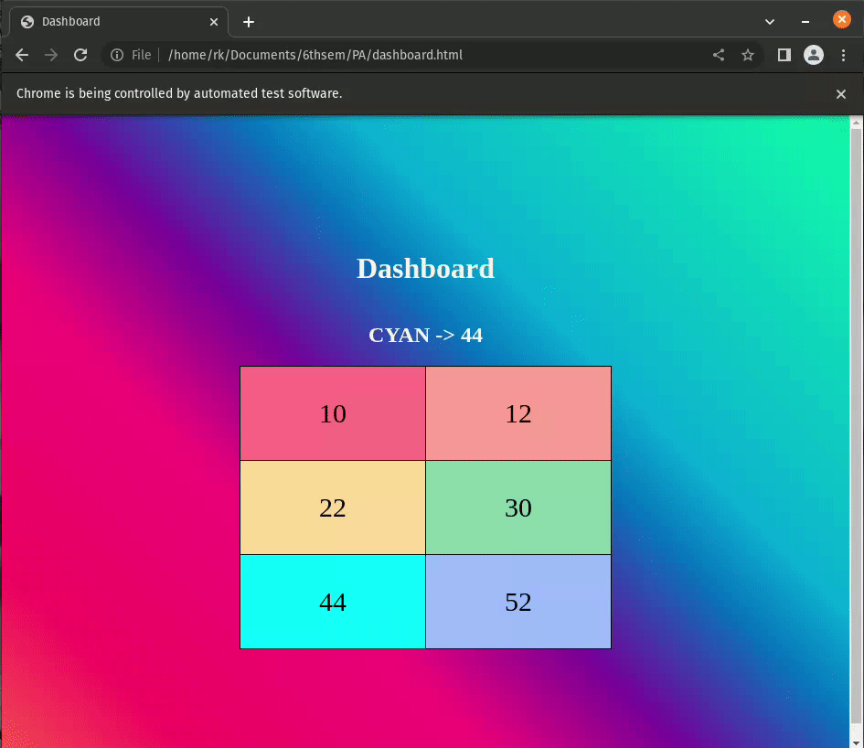

## Multi-Threading Using Python (Dashboard)

This is a dashboard that shows the number of threads running in the background. It is built using Python and HTML.

### Technologies Used
- Python
    * `threading` (for creating threads)
    * `time` (for delaying the threads)
    * `Selenium` (for automatically refreshing the page and loading the dashboard)
    * `lxml` (for parsing HTML)
- HTML
- CSS

### Result
Random numbers are generated in the background by 6 threads. The dashboard shows the current change in the number with the help of colors.

